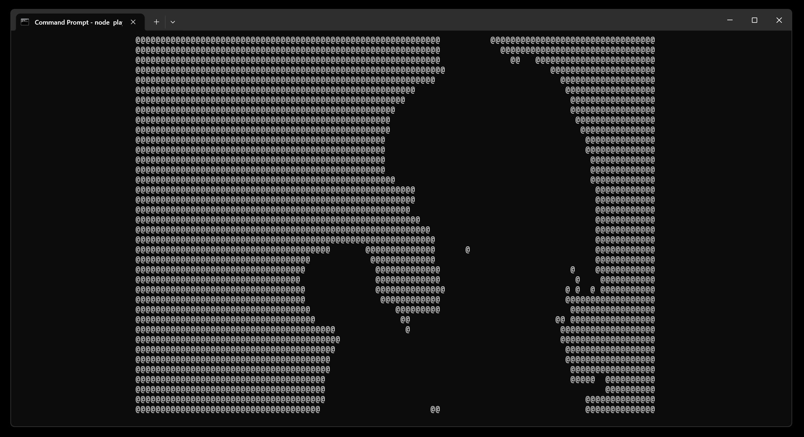

# Bad Apple



使用 Node.js 在終端機中播放 Bad Apple。

## 安裝

Windows 需要以系統管理員權限，使用 Chocolatey 安裝 Python 與 Visual Studio 2026 的 C++ 工具：

```bash
choco install python -y
choco install visualstudio2026-workload-vctools -y

# 解除安裝
choco uninstall visualstudio2026-workload-vctools -x -y
choco uninstall visualstudio-installer visualstudio2026buildtools visualstudio2026-workload-vctools -n --skip-autouninstaller --force
# 在 Chocolatey 中已經清除完相關套件資訊後，最後再手動開啟 Visual Studio Installer 來進行解除安裝
```

> [!NOTE]
> 細節安裝方式請參考 [node-gyp 的 Windows 安裝指南](https://github.com/nodejs/node-gyp#on-windows)

以及如果沒有 FFmpeg 與 yt-dlp 就一起安裝：

```bash
winget install --id=Gyan.FFmpeg -e
winget install --id=yt-dlp.yt-dlp -e
```

然後安裝所需的依賴：

```bash
npm install
```

## 使用方法

下載 Bad Apple 影片：

```bash
# CMD
fetch_video.cmd

# Git Bash
./fetch_video.sh
```

開始播放 Bad Apple：

```bash
node play.js
```
